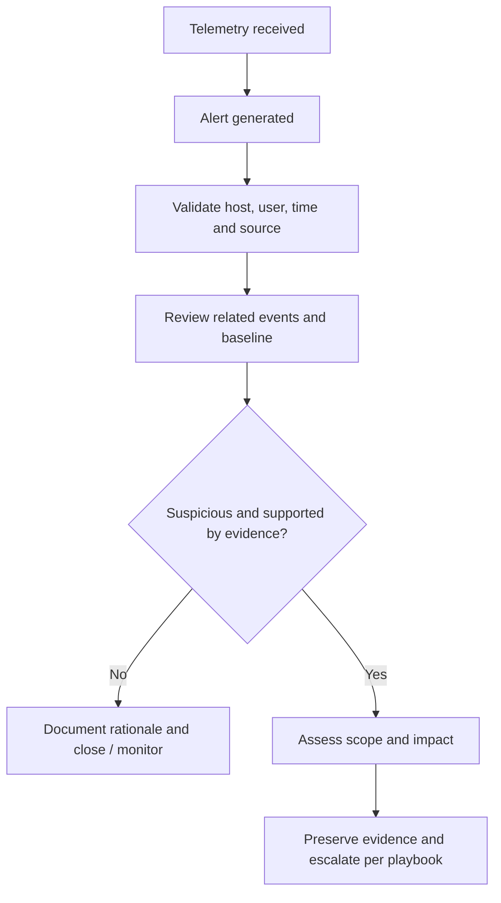

# L1 SOC alert workflow

```mermaid
flowchart TD
    A[Telemetry received] --> B[Alert generated]
    B --> C[Validate host, user, time and source]
    C --> D[Review related events and baseline]
    D --> E{Suspicious and supported by evidence?}
    E -->|No| F[Document rationale and close / monitor]
    E -->|Yes| G[Assess scope and impact]
    G --> H[Preserve evidence and escalate per playbook]
```

An alert is a signal, not a verdict. Do not label activity malicious solely because a rule fired.
